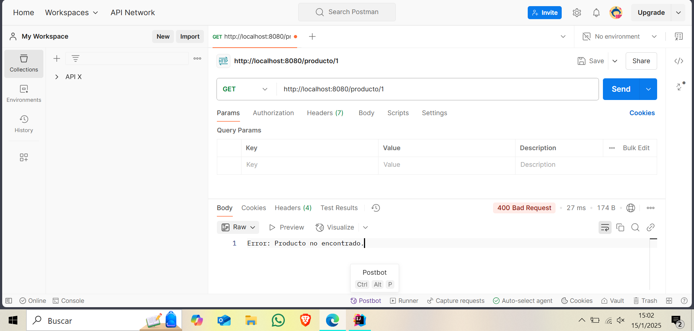

# PRUEBA 2B - Sebastian Aisalla
---

## **Instrucciones para Ejecutar la API**

### **Requisitos**

- **Java 21**
- **Gradle** (o Maven)
- **Postman Web** para las pruebas

### **Pasos para Ejecutar**

1. **Clonar el Repositorio**
   ```bash
   git clone https://github.com/Sebasky26/InventarioAPI.git
   cd InventarioAPI
   ```

2. **Compilar y Ejecutar la Aplicación**

   Con **Gradle**:
   ```bash
   ./gradlew bootRun
   ```
3. **Probar la API en Postman Web**

    - **GET** - Consultar producto:
      ```bash
      GET http://localhost:8080/producto/1
      ```

   

    - **POST** - Agregar producto:
      ```bash
      POST "http://localhost:8080/producto?idProducto=1&nombre=CelularHonor&cantidad=23"
      ```

   

   - **PUT** - Actualizar stock:
     ```bash
     PUT "http://localhost:8080/producto/1?nuevaCantidad=34"
     ```

   

---

## **Descripción del Proyecto**

### **Partes del Código**

1. **Parte 1: Programación Defensiva**
    - Validación de entradas en métodos para evitar errores.
    - Métodos: `consultarProducto()`, `agregarProducto()`.

2. **Parte 2: Programación por Contrato y Aserciones**
    - Uso de **assert** para validar precondiciones.
    - Método: `actualizarStock()`.

3. **Parte 3: Creación de la API REST**
    - Endpoints con **Spring Boot** para manejar consultas, inserciones y actualizaciones.

### **¿Por qué No Se Usó una Base de Datos?**

- Se utilizó un **HashMap** como estructura de almacenamiento en memoria para mantener la solución simple y enfocada en
  la lógica.
- Al reiniciar la aplicación, los datos se pierden, pero esto facilita la comprensión de los conceptos solicitados.

---

## **Pruebas Unitarias**

- Implementadas con **JUnit 5**.
- Validan tanto **casos correctos** como **casos inválidos**.

### **Pruebas Unitarias:**

1. **Agregar Producto Correctamente**
2. **Agregar Producto con ID o Cantidad Inválidos**
3. **Actualizar Stock Correctamente**
4. **Validación de Aserciones en `actualizarStock()`**

### **Ejecutar Pruebas:**
Con **Maven**:

```bash
mvn test
```

Resultado esperado:

```
BUILD SUCCESSFUL
```


---
